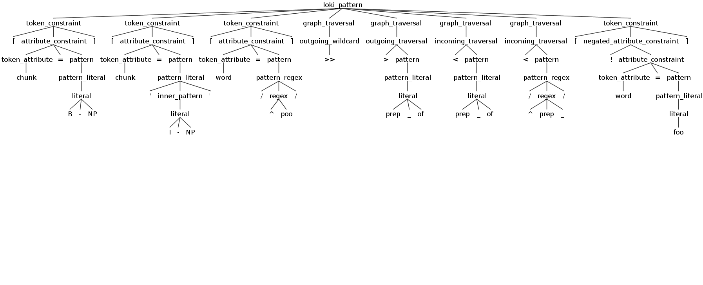

### loki

Just enough Odin to get into trouble.

`loki` is an IE pattern language based on Odin.  If you're looking for a battle-tested, feature-rich language for IE, use [Odin](https://arxiv.org/pdf/1509.07513.pdf).

`loki` does not currently support conjunctive or disjunctive token attribute constraints (ex. `[tag=/^N/ & word=/^m/]`) or quantifiers.

Research only.  Turn back now.  Frost giants ahead...

### Installation

`pip install -e .`


### Development

`pip install -e ".[test]"`

## Altering the `antlr4` grammar

The `antlr` grammar for `Loki.g4` (referenced in the instructions below) is located under the `loki` directory.

### `python`

```
antlr4 -Dlanguage=Python3 Loki.g4 -o python
cd python
python test_loki.py test.txt
```

### `java`
```
antlr4 Loki.g4 -o java
cd java
# NOTE: ensure you've add the jar to your CLASSPATH
javac Loki*.java
grun Loki loki_pattern -gui
[chunk=B-NP] [chunk="I-NP"] [word=/^poo/] >> >/^prep_/
```


## Testing

`green -vv --run-coverage`
